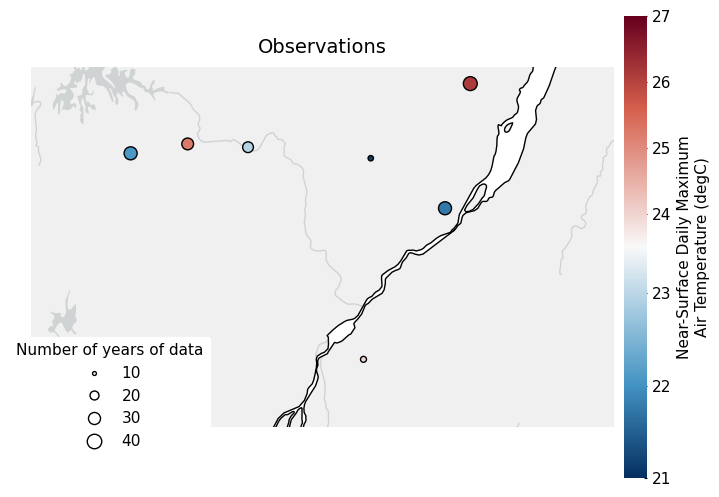
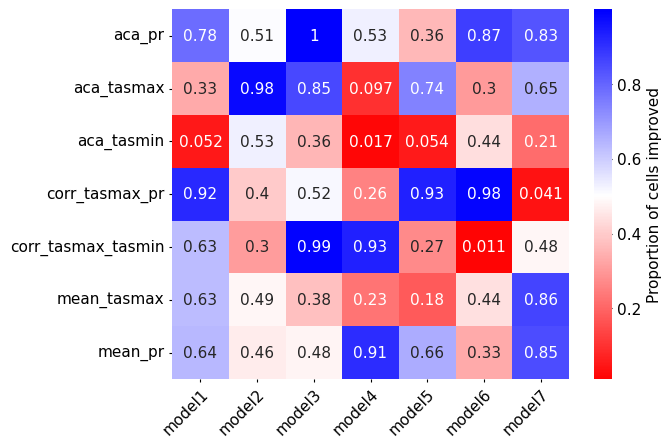
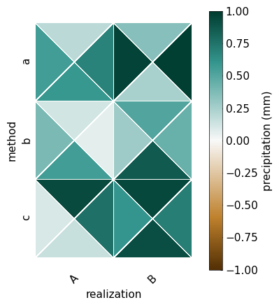
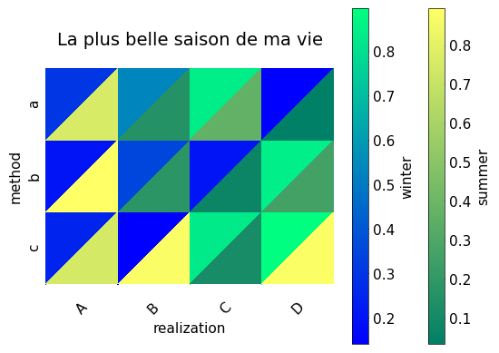

Gallery
========

Here is a gallery of examples of `figanos`.
Go to the examples to see how to generate these figures.

Timeseries
^^^^^^^^^^^
Full code in the `Timeseries notebook <notebooks/figanos_timeseries.ipynb>`_.

Maps
^^^^
Full code in the `Maps notebook <notebooks/figanos_maps.ipynb>`_.

.. image:: _static/_gallery/gdf_map.png
    :width: 30%
    :target: notebooks/figanos_maps.html#GeoDataFrame-on-Maps

Miscellaneous
^^^^^^^^^^^^^
Full code in the `Miscellaneous notebook <notebooks/figanos_misc.ipynb>`_.

Multiple plots
^^^^^^^^^^^^^^

Full code in the `Multiple plots notebook <notebooks/figanos_multiplots.ipynb>`_.

